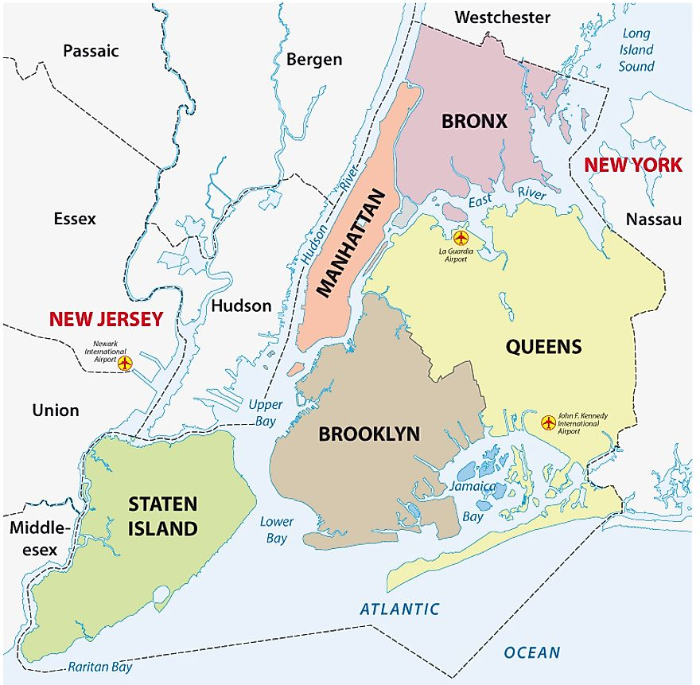
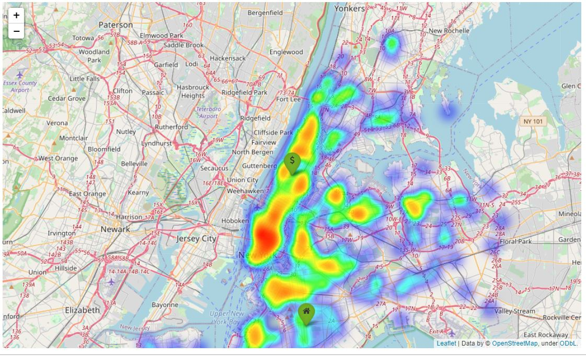

# PROJECT MODULE II

# Finding Kaggle Dataset and enriching with scraping.
The aim of this project is to find and enrich a dataset that we must select from different sources. I have decided to use the following kaggle dataset ["New York City Airbnb Open Data"](https://www.kaggle.com/dgomonov/new-york-city-airbnb-open-data) because is a information I´m familiar with, it is a clean dataset with high level of usability and  I can find articles and webs in order to enrich it.

To achive all this I will follow nexts steps:
>1. **Explore Kaggle Database**. And find the one that I will foccus on. I decided to use New York City Airbnb Open Data.
>2. **Find usefull information to enrich my data conclusions** I decided to enrich my information with NY monuments data by using web scraping and NY restaurants API.
>2. **Think on a wire conductor**  What do I whant to support with this info ?
>3. **Clean the dataset and the scraping info**. which are the usefull datas to find and support my hypothesis?
>4. **Analyze the data**. 
>5. **Make it visual**. For me and for our client to be understable

### Hypothesis to defend
Our client is an entreperneur that whant to buy both, estate for condition them for renting and locals to conditions them for restaurants. 
All based in NY neighborhoods, and they want to know which are the best for each option.

### Exploring datasets and enriching information.
I started with a clean dataset with the following shape (48895, 16), but with non usefull columns that I decided to drop and I also made some clening funtion in order to get my clean dataset with a shape of (37171,7).
After having a cleaning Dataset I enrich it in order to have restaurants and monuments information.

### Visualization and conclusions
I have done both bar chart and heat map for showing as best as posible our conclusion. A preview would be the following:

**If you want further information of muy project, please visit it!**